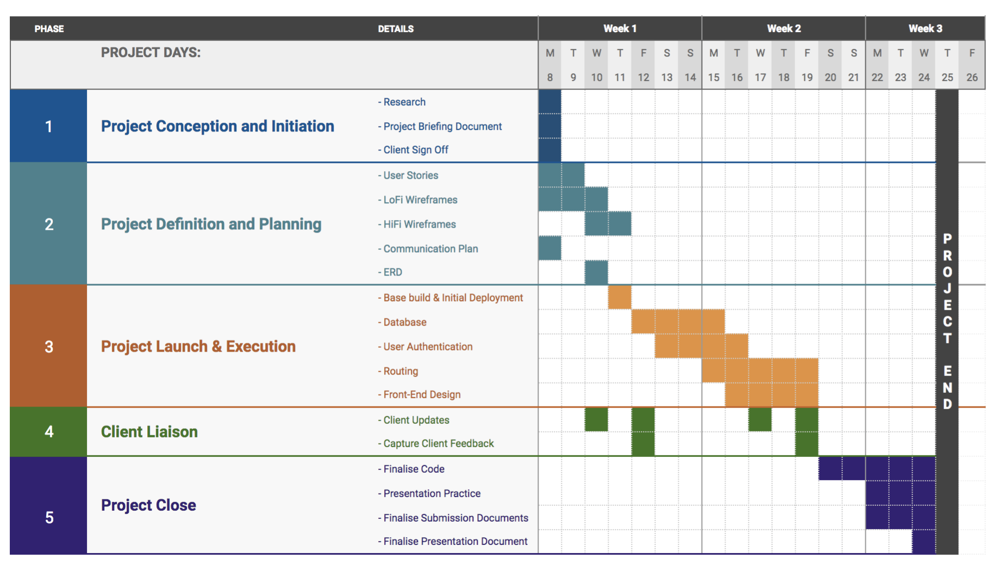
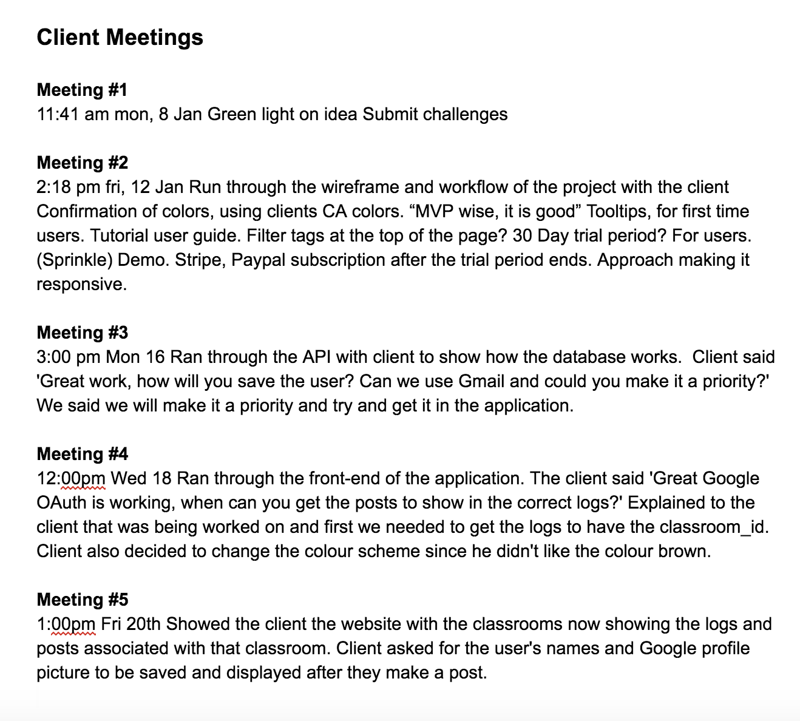
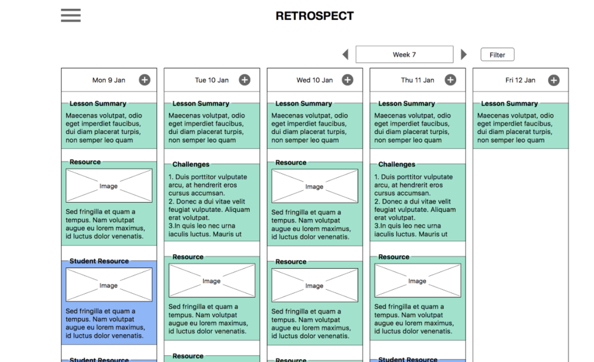
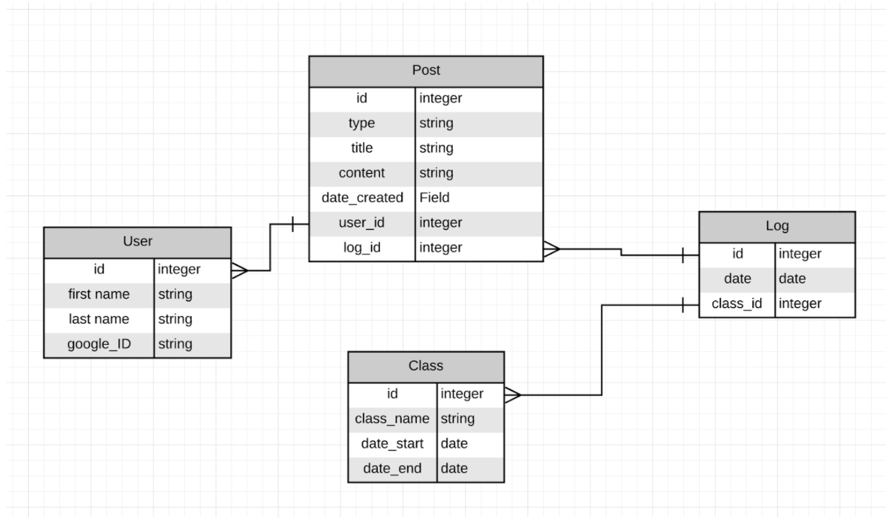

# README

# RETROSPECT

# Table of Contents
[1. Retrospect ](#retrospect)

[2. Instillation ](#instillation)

[3. The Client](#theclient)

[4.The Problem](#theproblem)

[5.Project Plan](#projectplan)

[6. Client Meetings](#clientmeetings)

[7. User Stories](#userstories)

[8. Wireframes](#wireframes)

[9. ERD](#erd)

[10. Known Bugs](#knownbugs)
## 1. Retrospect

Retrospect is a full stack application powered by NodeJS and React that allows Teachers to organize their resources for students. Retrospect is designed so that every day the teacher inputs a log that contains the following;
- Summary of the Day's Lesson.
- Coding Challenge of the Day.
- Resources that were used that day.

The student has full access to these resources and logs into the application via their Gmail account provided by Coder Academy. After logging in, the Student joins the classroom where they can view the log posted by the teacher.
The student can;
- Sign in with their Gmail via Google OAuth
- See the date of the log
- See whether the post is a challenge, post or resource.

This gives context to the student where they can see what was covered that day, if they ever missed a class or are just revising.

Currently, Retrospect is in version 1 where the key features are below

- User logs in and out with their Gmail
- User can make join a classroom
- User can create a log
- User can create a post within the log
- Users photo from Gmail is shown
- Days are automatically shown after entering the date

The features that will be included in version 2 is below
- Student can search for notes
- Students can filter by weeks 

## Deliverables 

The Google Drive can be accessed by clicking the link below

The Powerpoint/User Surveys for Retrospect can be found by clicking the link below 

The link to the API can be found by clicking the link below

Link to the React App can be seen by clicking the link below 

### 2. Instillation

To install Retrospect, please follow the instructions below.
1. Download or clone the repo
1. In command line, move into the api folder and run `npm install`
1. Move out of the api folder and then move into the retro folder and run the command `yarn install`
1. To use Google OAuth, you will need a set of dev keys. You can do this by setting up your own keys to Google OAuth at Google. Once you have your cookies, create a dev.js file in the config folder.
1. Retrospect also has tests and you can run these by moving into the api folder and running the command `npm test`

### 3. The Client
The client is a teacher at a coding bootcamp and for privacy reasons lets call him Mr.Blockchain. Mr. Blockchain has 20 students and he wants a way where he can put his summary of the day, challenge of the day and resources for that day in an organized and easy to find manner. He believes this will allow the students to study smarter, and get more out of their revision.

### 4. The Problem
There is no hub/central location to go to for class resources that allow students to catch up if they missed a class, or what to revise.

As a student, it is difficult to access resources provided during classes to help revise topics.

As a teacher, we want to make sure that every student can access all resources to allow them to stay up to date with the lessons as well as allowing me to focus on the current days lesson.

Resources are pieces of information that are shared to the class that help demonstrate a lesson. These can include:
- Links to Github repositories
- Links to articles and tutorials
- Files for later reading
- Challenges
- Summary of days lesson

Currently the only source to access information from past lessons is the #teacher-resources channel on Slack. This can be difficult to use because:
- Slack only stores 10,000 messages in total. Once this threshold is met, the oldest messages are discarded and not accessible
- Posts do not have extra information that makes it easy to search for, so it is not clear why some posts were shared.
- When searching for information, irrelevant results frequently appear.

### 5. Project Plan
The project plan can be seen below. The project was broken down into 5 specific parts

1. Project Conception and Initiation
1. Project Definition and Planning
1. Project Launch and Execution
1. Client Liason
1. Project Close

### 6. Client Meetings

The client meetings can be found below where we had constant contact with Mr.Blockchain.

### 7. User Stories
A link to user stories can be found here

### 8. Wireframes  
The wireframes can be seen below. As seen the student gets access to the lesson summary, challenge and resources.

### 9. ERD

The ERD can be found below where we have models of users, posts, logs and classes.

### 10. Known Bugs

1. When the user creates a new log, they can't create a post on that log straight away. They can only create the post on that log after they refresh the page.
1. The application deployed on Heroku has some routing issues and so struggles to display the view to the screen.
1. When scrolling sideways in the logs, the logs sometimes go behind another log. 
