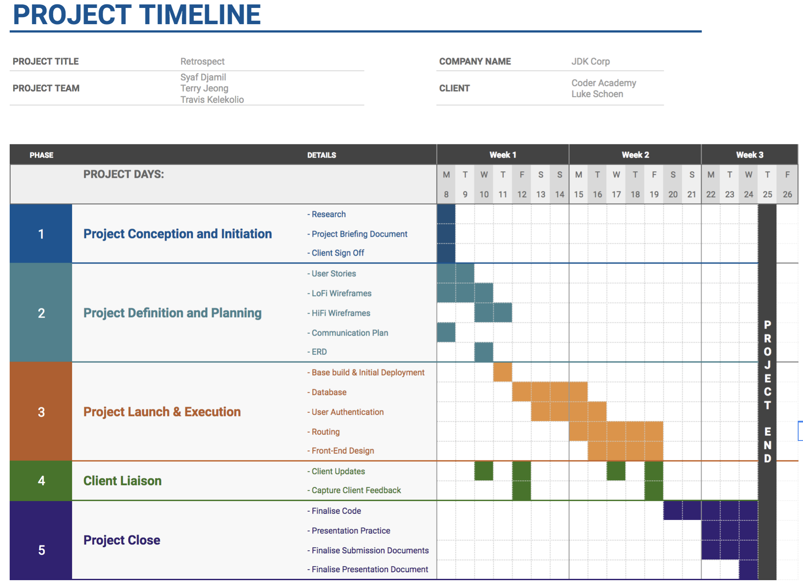
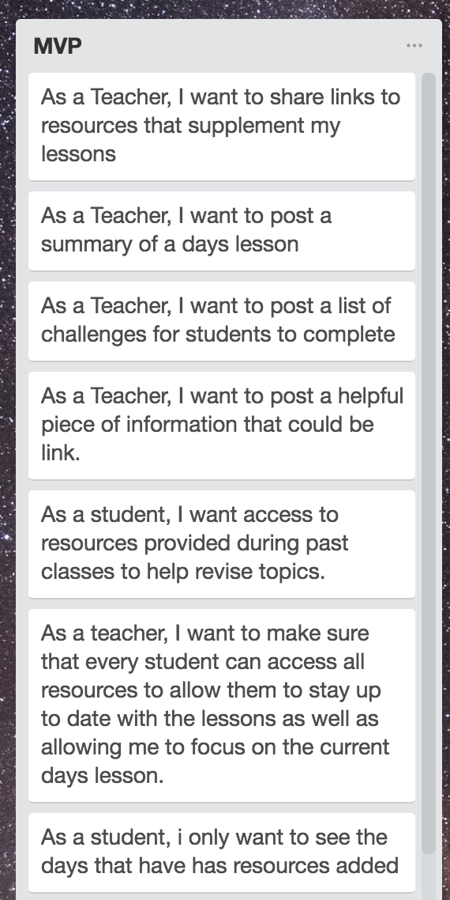
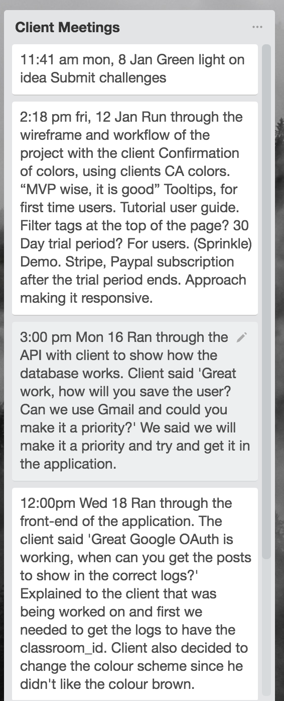

# README

## Retrospect

Retrospect is a full stack application powered by NodeJS and React that allows Teachers to organize their resources for students. Retrospect is designed so that every day the teacher inputs a log in the classroom that contains the following posts;
- Summary of the Day's Lesson.
- Coding Challenge of the Day.
- Resources that were used that day.

The student has full access to these resources and logs into Retrospect via their gmail account provided by Coder Academy. After logging in, the Student joins the classroom where they can view the logs posted by the teacher.

# Table of Contents
[1. INSTILLATION GUIDE](#instillation)

[2. TESTS ](#tests)

[3. THE CLIENT ](#theclient)

## 1.Installation Guide
To run the application, please follow the instructions below
- Download or clone the repo.
- In command line, cd into the api folder and run the command `npm install`
- After doing that, cd into the retro folder and run the command `yarn add`
- Great! Now, making sure mongodb is running on your device, run both the api and react server by running the commands `npm start` and `yarn start`

## 2. Tests
To run the tests in the application go to the api folder and run the command `npm test`

### 3. The Client
Retrospect's client is a teacher (for privacy purposes let's call him Mr. Blockchain) who teaches a coding bootcamp to 20 students.

### 4. The Problem

There is no hub/central location to go to for class resources that allow students to catch up if they missed a class, or what to revise.

As a student, it is difficult to access resources provided during classes to help revise topics.

As a teacher, you want to make sure that every student can access all resources to allow them to stay up to date with the lessons as well as allowing me to focus on the current days lesson.

Resources are pieces of information that are shared to the class that help demonstrate a lesson. These can include:
- Links to Github repositories
- Links to articles and tutorials
- Files for later reading
- Challenges
- Summary of days lesson

Currently the only source to access information from past lessons is the #teacher-resources channel on Slack. This can be difficult to use because:
- Slack only stores 10,000 messages in total. Once this threshold is met, the oldest messages are discarded and not accessible.
- Posts do not have extra information that makes it easy to search for, so it is not clear why some posts were shared.
- When searching for information, irrelevant results frequently appear.

### 5. The Solution

Our solution is to create a platform that allows teachers to post lesson resources that are organised in such a way that a student can easily access through various filters.

The teacher will upload the following so that the student can see what was done on that specific day.
- Summary of the lesson that day
- The Challenges for the students
- Useful links related to the challenge or what was taught that day.
- This will allow students who have missed classes or looking to revise to get information without disrupting a teachers lesson plan.

### 6. Project Timeline

The project timeline was broken into 5 stages

1. Project Conception and Initiation
1. Project Definition and Planning
1. Project Launch and Execution
1. Client Liaison
1. Project Close

### 7. User Stories

The User stories can be found below. The user stories are broken up from the perspective of a teacher and a student to best craft the idea for our solution.

### 8. Wireframes  

### 9. ERD

### 10. Client Meetings

The summary of the client meetings can be seen below

